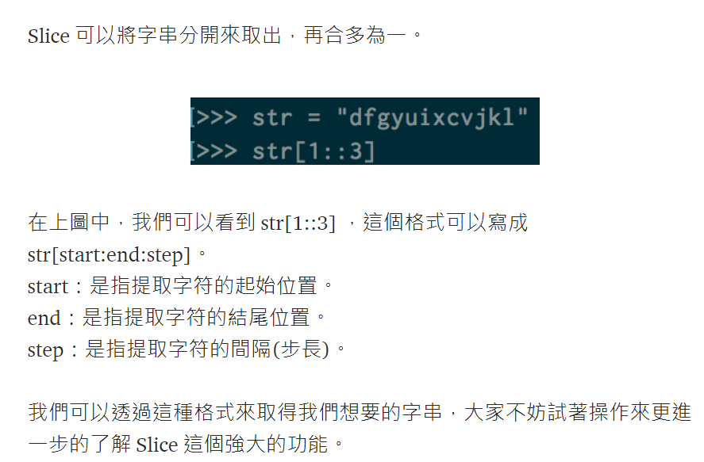

# 數字反轉

## 設計說明：
請撰寫一程式，讓使用者輸入一個正整數，將此數值以反轉的順序輸出。

## 輸入說明

一個正整數

## 輸出說明

將此數值以反轉的順序輸出

## 輸入輸出範例

### 範例1
範例輸入1
```
31283
```
範例輸出1
```
38213
```
### 範例2
範例輸入2
```
1003120
```
範例輸出2
```
0213001
```

★字串的slice功能

