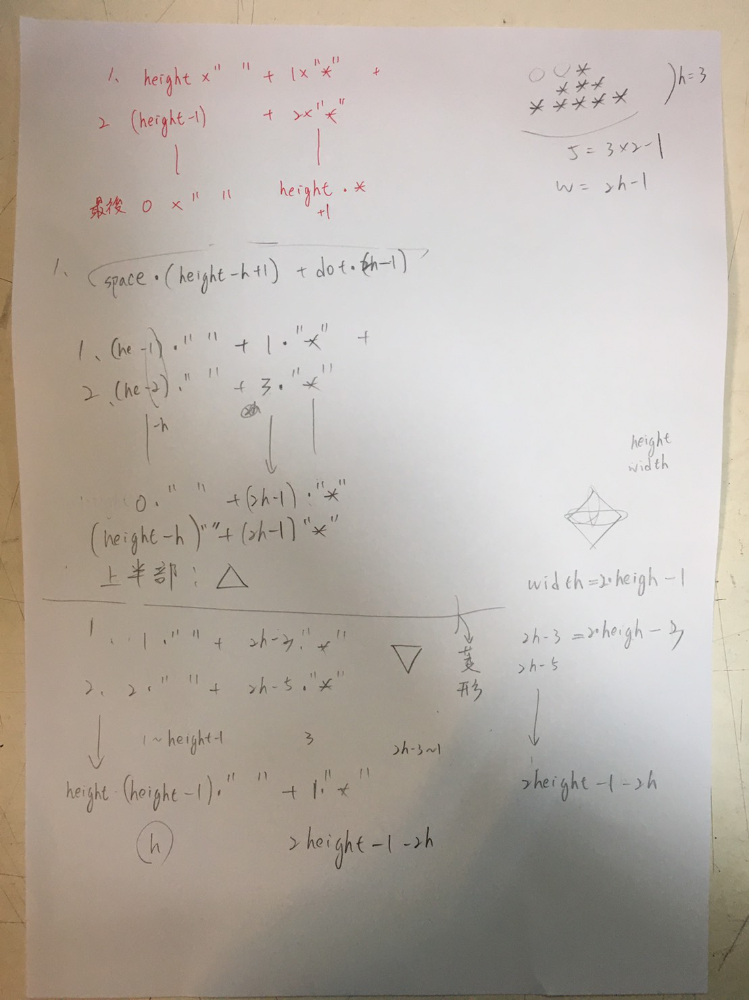

# 繪製等腰三角形

## 設計說明：
請撰寫一程式，依照使用者輸入的n，畫出對應的等腰三角形。

## 輸入說明

一個正整數

## 輸出說明

以 * 畫出等腰三角形
（每列最後一個 * 的右方無空白）

## 輸入輸出範例

### 範例輸入

```
7
```

### 範例輸出

```
      *
     ***
    *****
   *******
  *********
 ***********
*************
```

思考過程:
