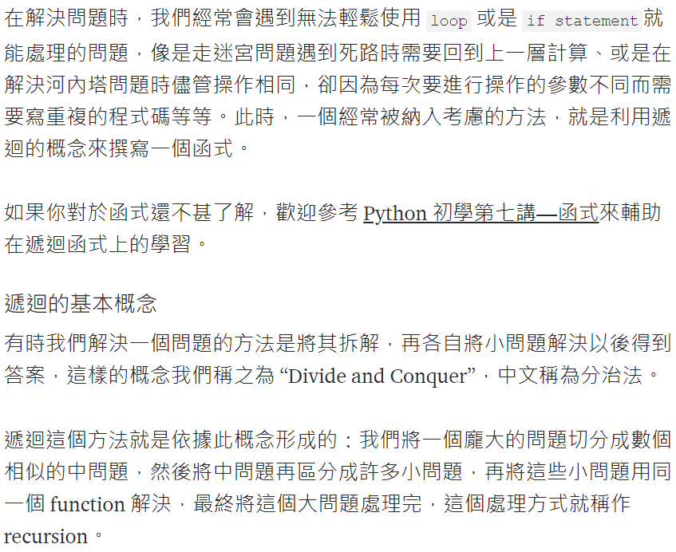
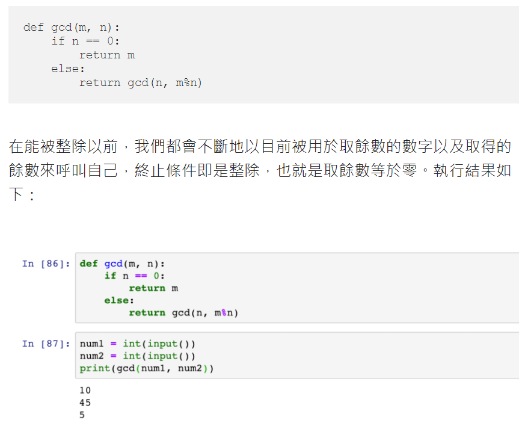

# 最簡分數

## 設計說明：

## 輸入說明

4個整數 x/y, m/n

## 輸出說明

計算: (x/y) + (m/n) = (p/q) -> p與q需要化到最簡

## 輸入輸出範例

參考資料
https://openhome.cc/Gossip/AlgorithmGossip/GCDPNumber.htm#Python2

★遞迴的講解
https://medium.com/ccclub/ccclub-python-for-beginners-tutorial-11ed5d300d3d
Python 初學第八講 — 遞迴

★最大公因數(輾轉相除法)

輾轉相除法
http://www.mathland.idv.tw/fun/euclidean.htm

輾轉相除法樹狀圖：
