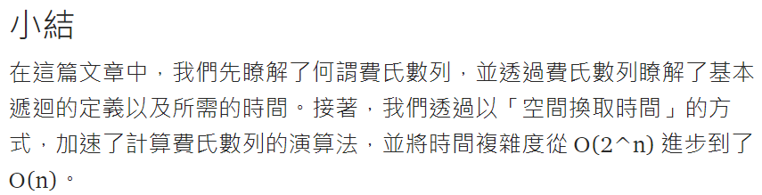

# 費氏數列

## 設計說明：
請撰寫一程式，計算費氏數列（Fibonacci numbers），使用者輸入一正整數num (num>=2)，並將它傳遞給名為compute()的函式，此函式將輸出費氏數列前num個的數值。

提示：費氏數列的某一項數字是其前兩項的和，而且第0項為0，第一項為1，表示方式如下：


## 輸入說明

一個正整數num (num>=2)

## 輸出說明

依輸入值num，輸出費氏數列前num個的數值（每個數值後方為一個半形空格）

## 輸入輸出範例

### 範例1
範例輸入1
```
10
```
範例輸出1
```
0 1 1 2 3 5 8 13 21 34 
```
### 範例2
範例輸入2
```
20
```
範例輸出2
```
0 1 1 2 3 5 8 13 21 34 55 89 144 233 377 610 987 1597 2584 4181 
```

https://openhome.cc/Gossip/AlgorithmGossip/FibonacciNumber.htm


https://medium.com/appworks-school/%E5%88%9D%E5%AD%B8%E8%80%85%E5%AD%B8%E6%BC%94%E7%AE%97%E6%B3%95-%E5%BE%9E%E8%B2%BB%E6%B0%8F%E6%95%B8%E5%88%97%E8%AA%8D%E8%AD%98%E4%BD%95%E8%AC%82%E9%81%9E%E8%BF%B4-dea15d2808a3


