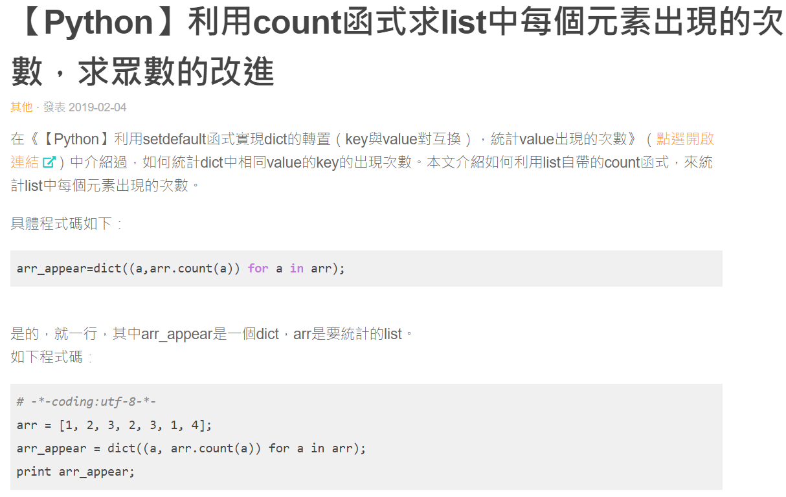
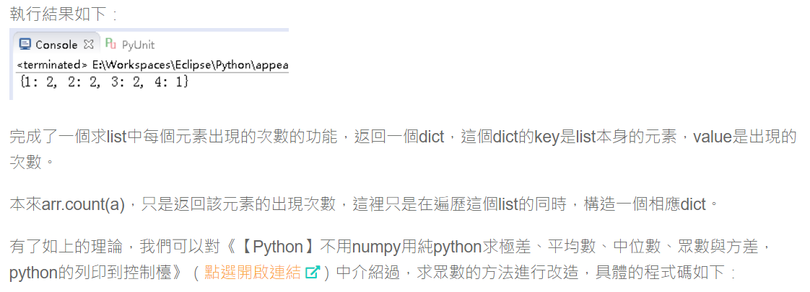
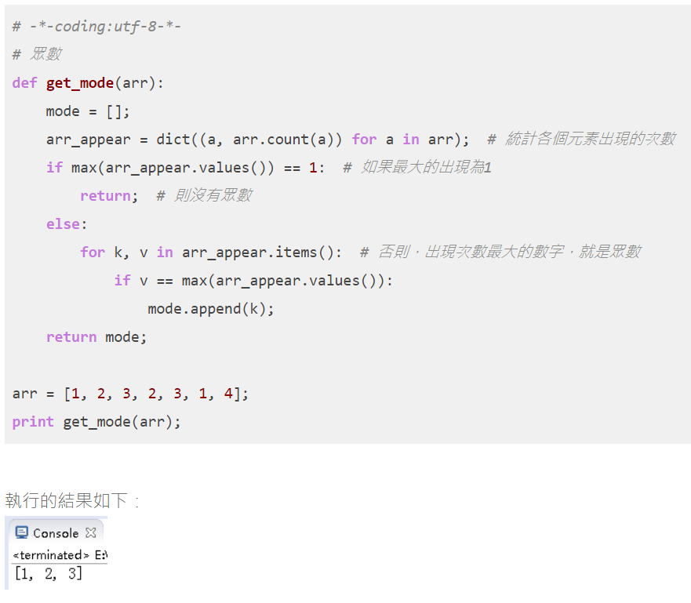

# 眾數

## 設計說明：
請撰寫一程式，讓使用者輸入十個整數作為樣本數，輸出眾數（樣本中出現最多次的數字）及其出現的次數。

提示：假設樣本中只有一個眾數。

## 輸入說明

十個整數

## 輸出說明

眾數出現的次數

## 輸入輸出範例

### 範例輸入

```
34
18
22
32
18
29
30
38
42
18
```

### 範例輸出

```
18
3
```

參考資料

https://www.itread01.com/content/1549265418.html



