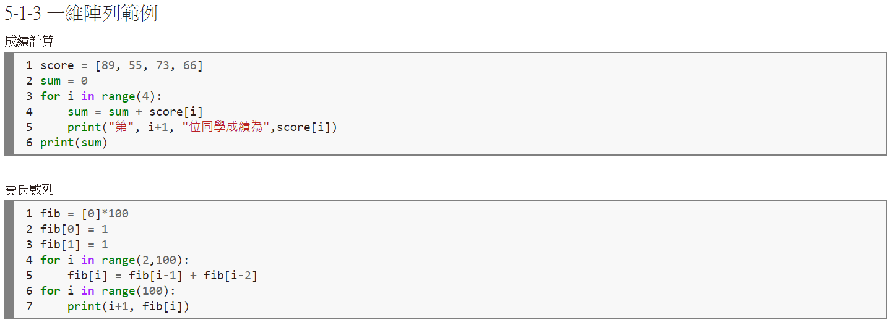
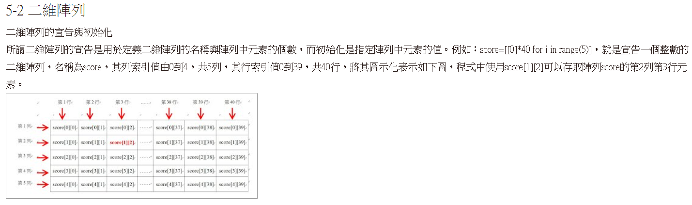
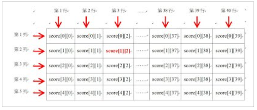
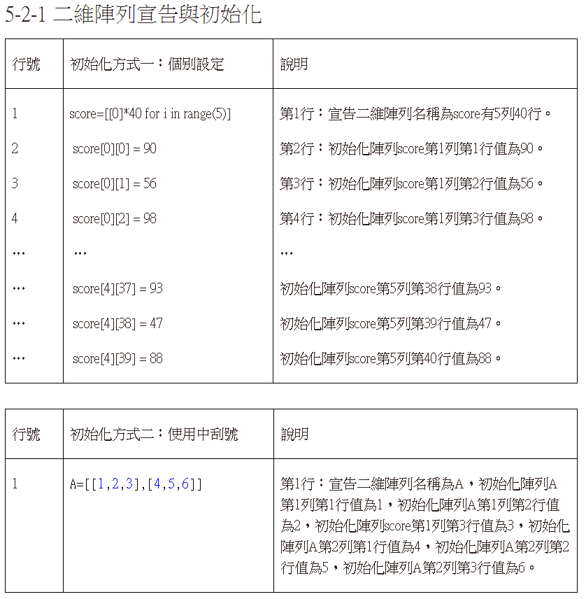
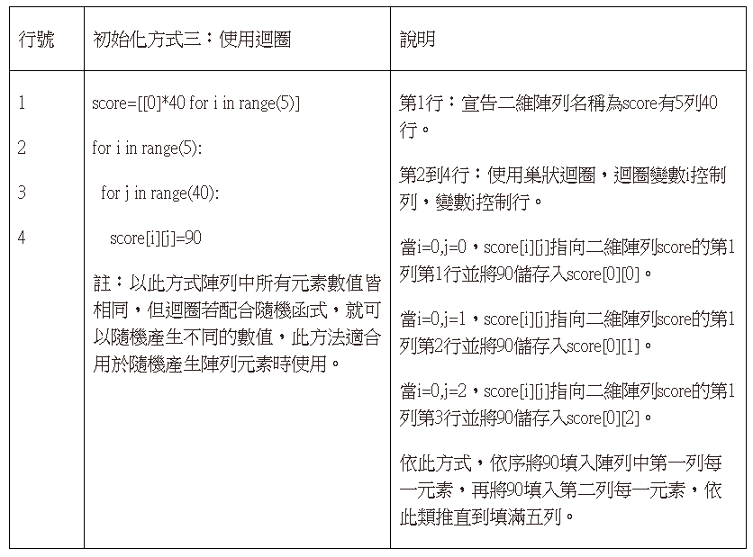
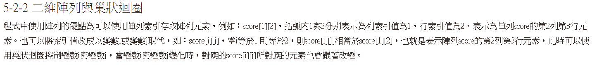
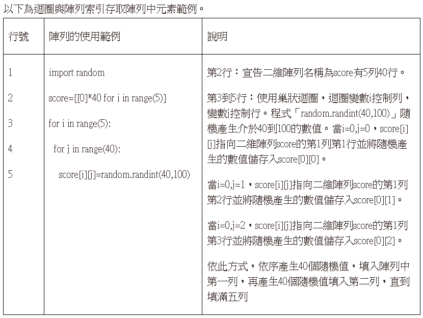
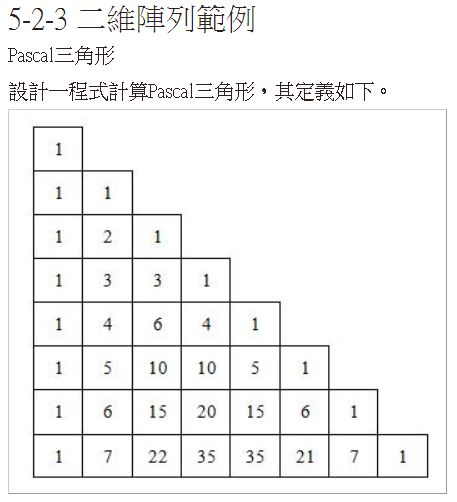
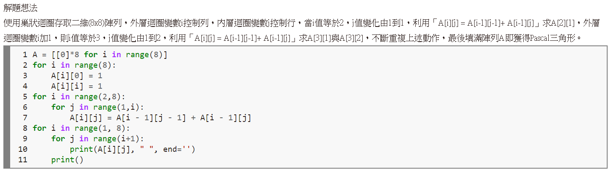

# 二維串列行列數

## 設計說明：
請撰寫一程式，讓使用者輸入兩個正整數rows、cols，分別表示二維串列lst 的「第一個維度大小」與「第二個維度大小」。

串列元素[row][col]所儲存的數字，其規則為：row、col 的交點值 = 第二個維度的索引col – 第一個維度的索引row。

接著以該串列作為參數呼叫函式compute()輸出串列。

提示：欄寬為4。

## 輸入說明

兩個正整數（rows、cols）

## 輸出說明

格式化輸出row、col的交點值

## 輸入輸出範例

### 範例輸入

```
5
10
```

### 範例輸出

```
   0   1   2   3   4   5   6   7   8   9
  -1   0   1   2   3   4   5   6   7   8
  -2  -1   0   1   2   3   4   5   6   7
  -3  -2  -1   0   1   2   3   4   5   6
  -4  -3  -2  -1   0   1   2   3   4   5
```
參考資料

https://sites.google.com/site/zsgititit/home/python-cheng-shi-she-ji/yi-wei-zhen-lie-yu-er-wei-zhen-lie-python









