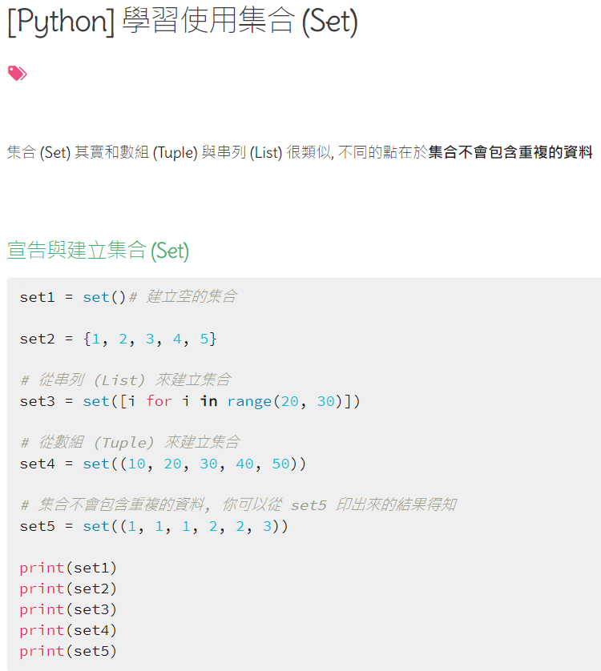
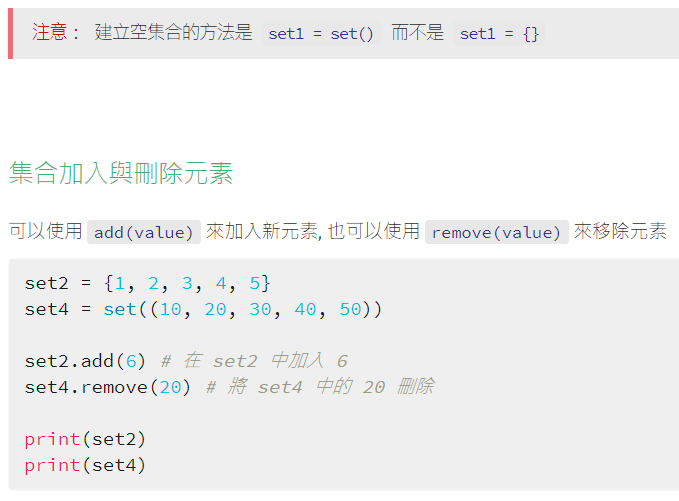
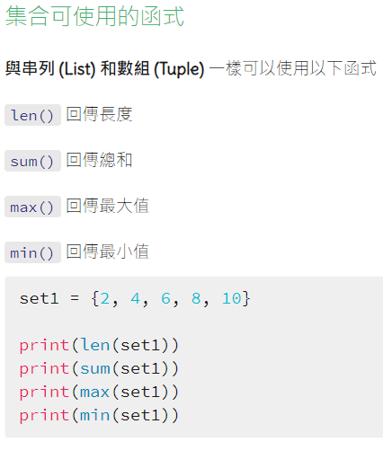
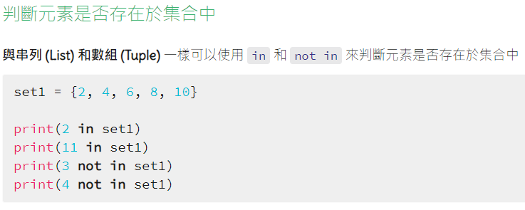
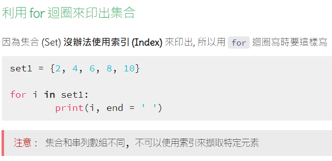
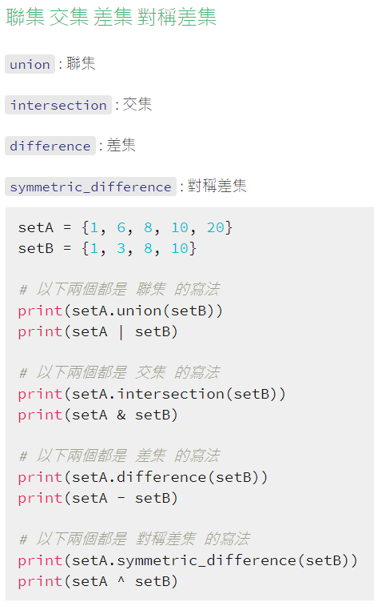
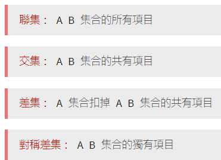
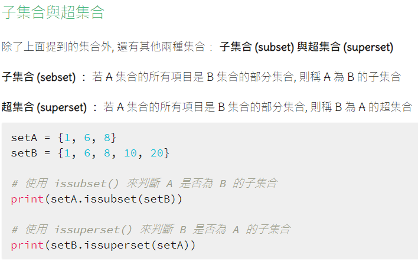
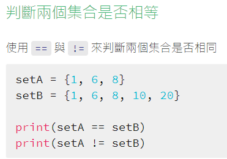

# 子集合與超集合

## 設計說明：
請撰寫一程式，依序輸入五個、三個、九個整數，並各自儲存到集合set1、set2、set3中。接著回答：set2是否為set1的子集合（subset）？set3是否為set1的超集合（superset）？

## 輸入說明

依序分別輸入五個、三個、九個整數

## 輸出說明

set2是否為set1的子集合（subset）？
set3是否為set1的超集合（superset）？

## 輸入輸出範例

### 輸入與輸出會交雜如下，輸出的部份以黑底表示

```
Input to set1:
```
3

28

-2

7

39
```
Input to set2:
```
2

77

0
```
Input to set3:
```
3

28

12

99

39

7

-1

-2

65
```
set2 is subset of set1: False
set3 is superset of set1: True
```

參考資料

https://wenyuangg.github.io/posts/python3/python-set.html



★寫注意的都該看





★





★用function來判斷是否為子集合跟超集合



