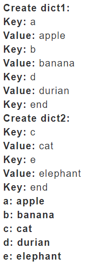
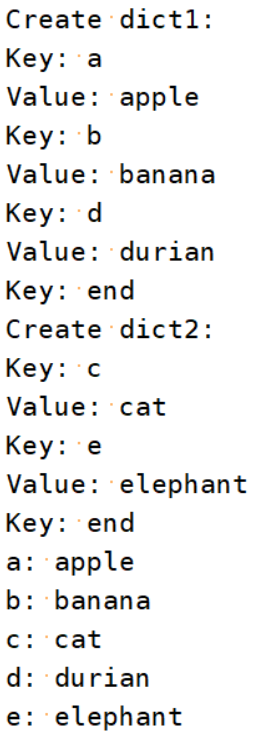
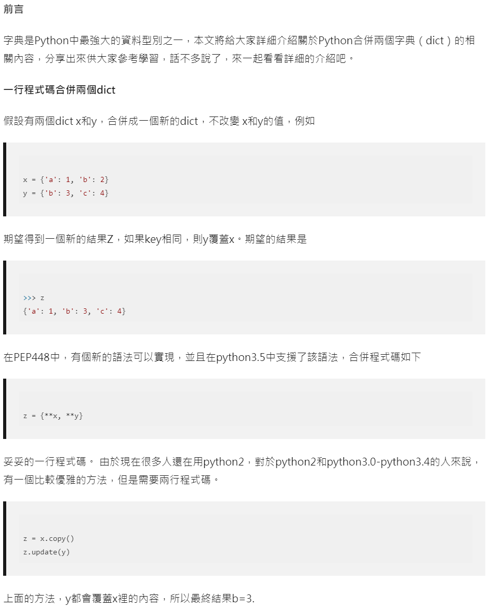
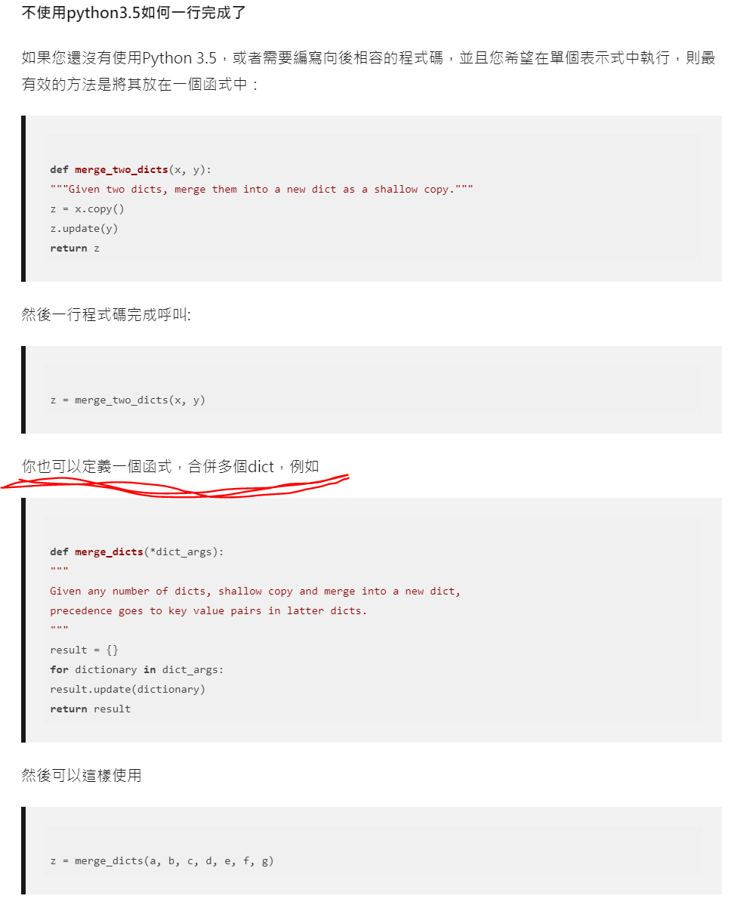
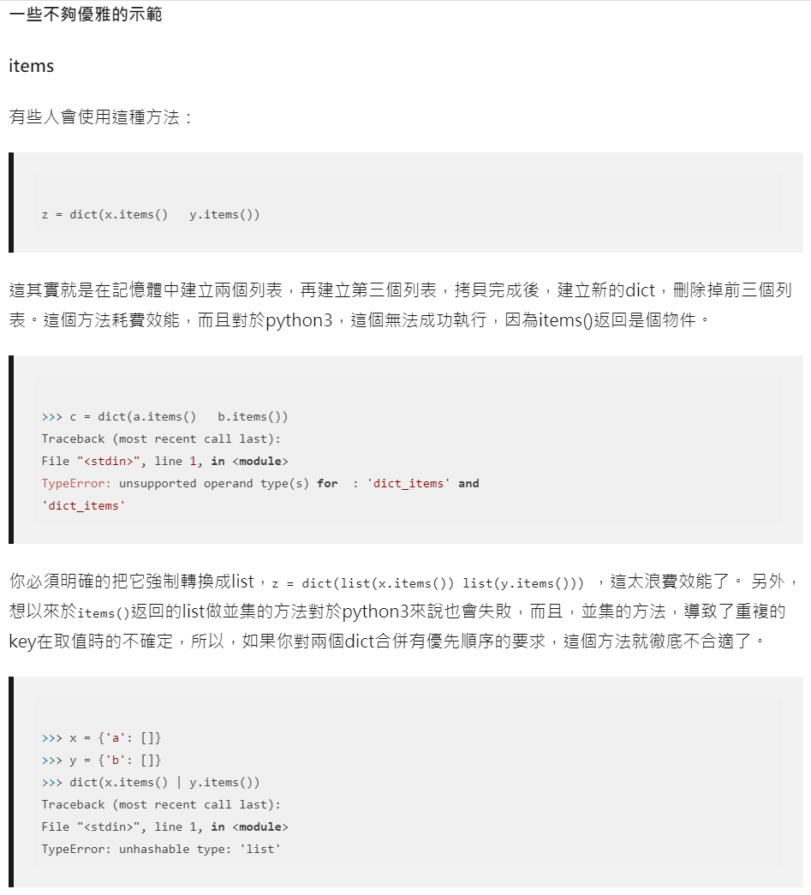
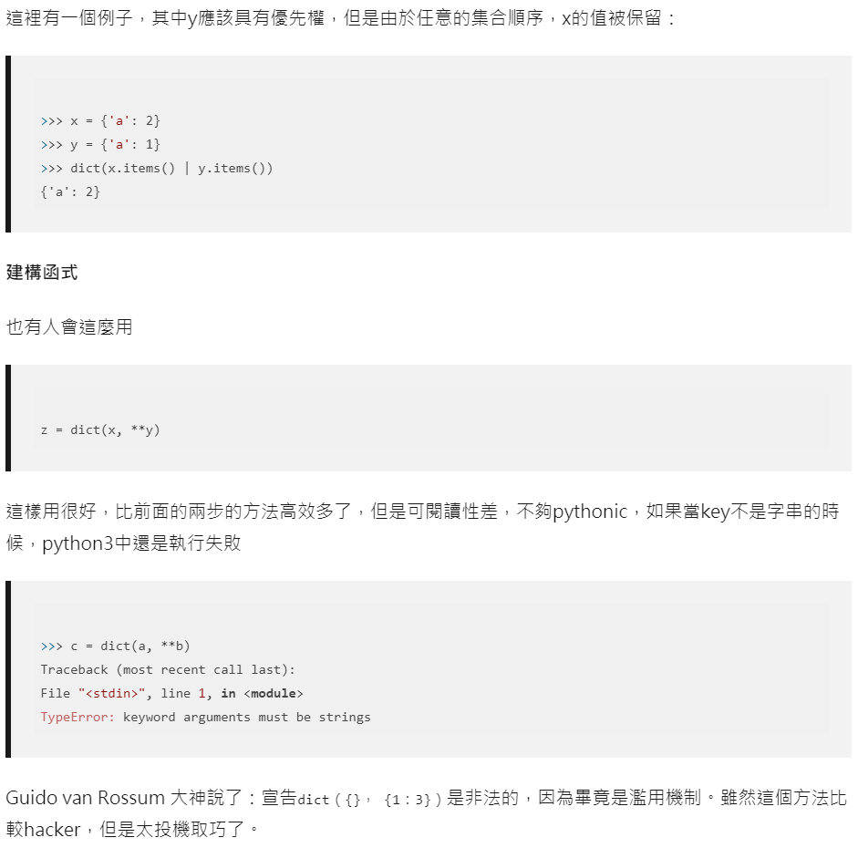
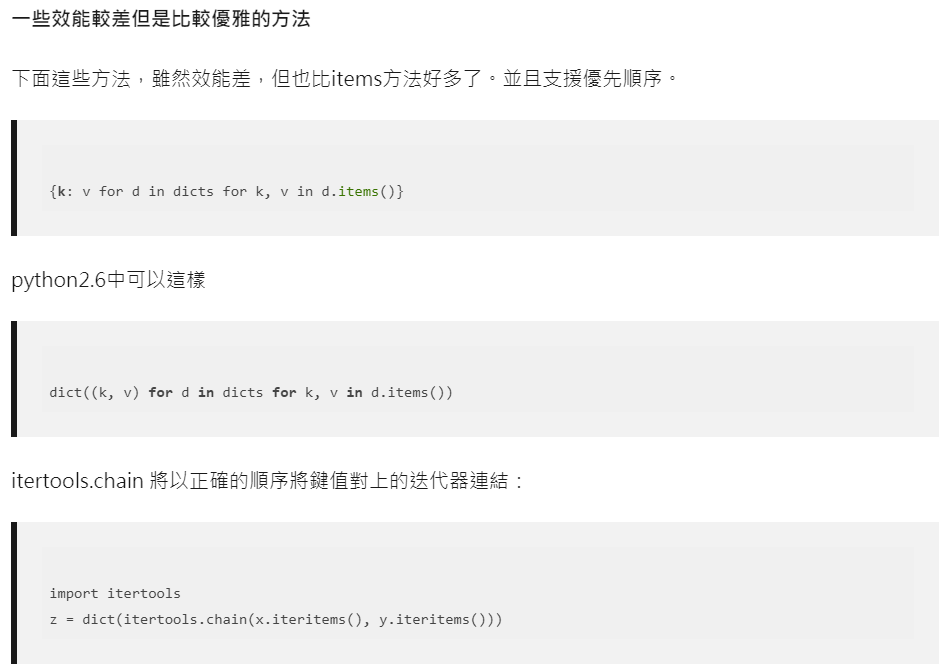
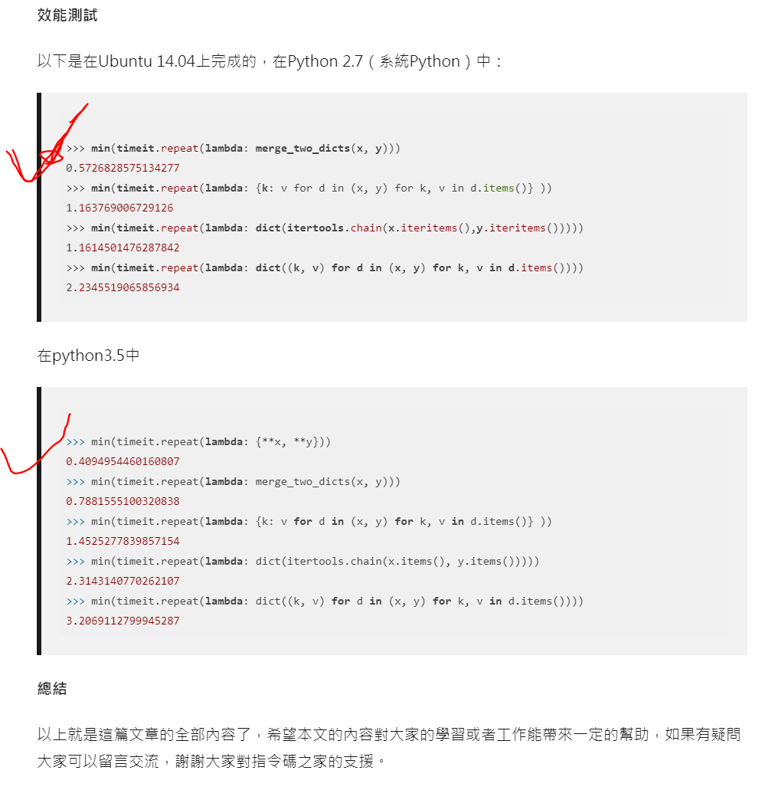

# 詞典合併

## 設計說明：
請撰寫一程式，自行輸入兩個詞典（以輸入鍵值"end"作為輸入結束點，詞典中將不包含鍵值"end"），將此兩詞典合併，並根據key值字母由小到大排序輸出，如有重複key值，後輸入的key值將覆蓋前一key值。

## 輸入說明

輸入兩個詞典，直至end結束輸入

## 輸出說明

合併兩詞典，並根據key值字母由小到大排序輸出，如有重複key值，後輸入的key值將覆蓋前一key值

## 輸入輸出範例

### 輸入與輸出會交雜如下，輸出的部份以粗體字表示

下圖中的 粉紅色點 為 空格

### 程式執行狀況擷圖
下圖中的 粉紅色點 為 空格

參考資料(字典合併)

https://codertw.com/%E7%A8%8B%E5%BC%8F%E8%AA%9E%E8%A8%80/364657/

Python中如何優雅的合併兩個字典（dict）方法示例

★ z = {**x, **y}這寫法很好

所有這些裡面，相同的key，都是後面的覆蓋前面的。

以下為錯誤示範:

