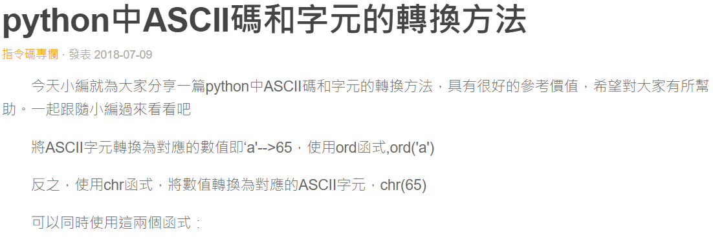
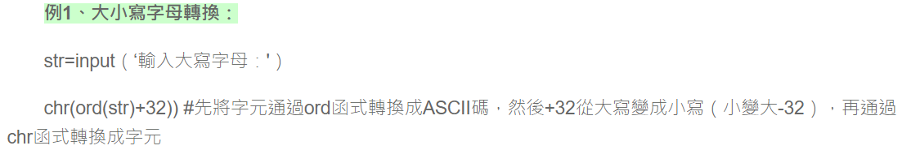
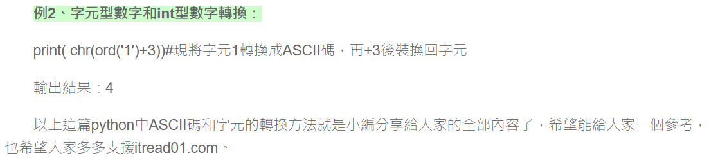

# 字元對應

## 設計說明：
請撰寫一程式，要求使用者輸入一字串，顯示該字串每個字元的對應ASCII碼及其總和。

## 輸入說明

一個字串

## 輸出說明

依序輸出字串中每個字元對應的ASCII碼
每個字元ASCII碼的總和

## 輸入輸出範例

### 範例輸入

```
Kingdom
```

### 範例輸出

```
ASCII code for 'K' is 75
ASCII code for 'i' is 105
ASCII code for 'n' is 110
ASCII code for 'g' is 103
ASCII code for 'd' is 100
ASCII code for 'o' is 111
ASCII code for 'm' is 109
713
```

參考資料

https://www.itread01.com/article/1531117923.html



★這一個轉換其實可以直接用.upper() /.lower()   -> 轉換成大寫 / 小寫


