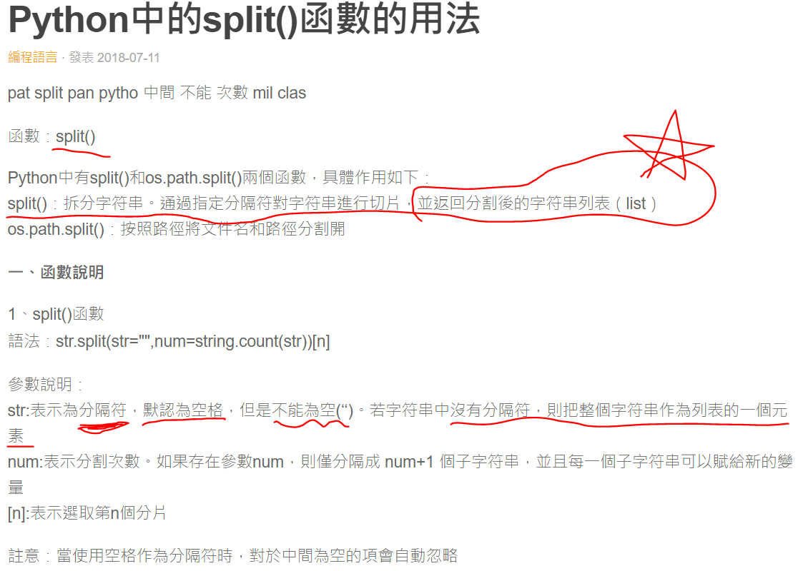
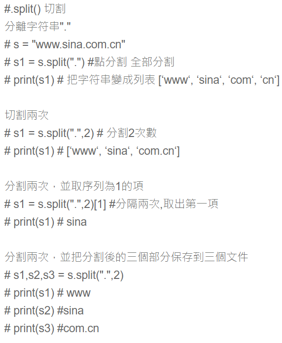
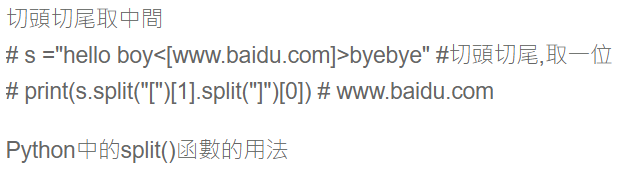
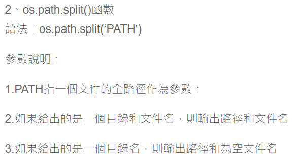
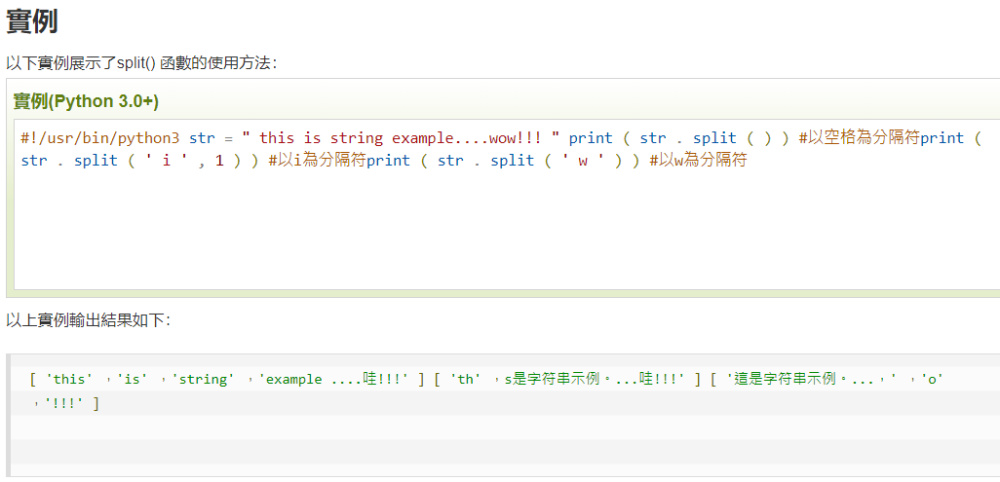
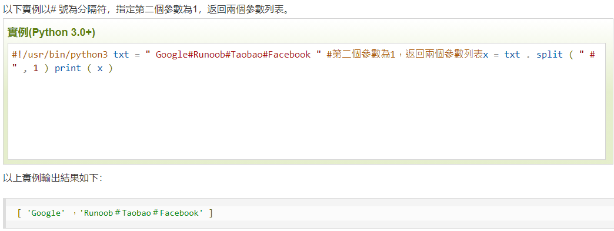
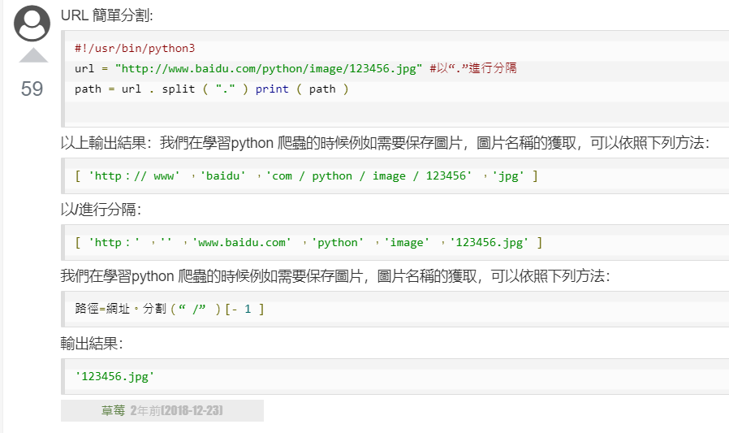

# 倒數三個詞

## 設計說明：
請撰寫一程式，讓使用者輸入一個句子（至少有五個詞，以空白隔開），並輸出該句子倒數三個詞。

## 輸入說明

一個句子（至少五個詞，以空白隔開）

## 輸出說明

該句子倒數三個詞

## 輸入輸出範例

### 範例輸入

```
Many foreign students study in FJU
```

### 範例輸出

```
study in FJU
```

Python中的split()函數的用法
https://www.itread01.com/content/1531306711.html



補充




Python3 split()方法
https://www.runoob.com/python3/python3-string-split.html

.png)


