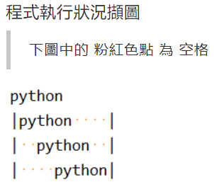

# 字串輸出

## 設計說明：
請撰寫一程式，要求使用者輸入一個長度為6的字串，將此字串分別置於10個欄位的寬度的左邊、中間和右邊，並顯示這三個結果，左右皆以直線 |（Vertical bar）作為邊界。

## 輸入說明

一個長度為6的字串

## 輸出說明

格式化輸出

## 輸入輸出範例

### 範例輸入

```
python
```

### 範例輸出

```
|python    |
|  python  |
|    python|
```

